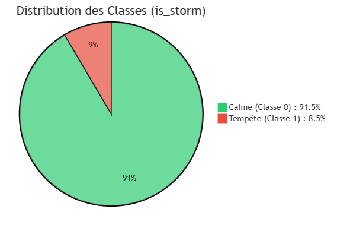

#  Documentation du Dataset : Geomagnetic Storm Prediction Dataset (Aurora)

> **Objectif :** Prédire l'occurrence des tempêtes géomagnétiques avec 6 heures d'avance pour protéger les infrastructures critiques.

---

## 1- Identification

| Paramètre | Détails |
| :--- | :--- |
| **Nom du Dataset** | Geomagnetic Storm Prediction Dataset (Aurora) |
| **Auteur(s)** | **Douae Rohand, Oumaima Ameziane, Raihana Mohito** |
| **Couverture temporelle** | Janvier 2019 — Décembre 2023 |
| **Date d'Accès (Collecte)** | 13 Mai 2026 |
| **Version** | 1.5 (Optimized Physics Features) |
| **Domaine** | Météorologie Spatiale / Data Science |
| **Statut** | Prêt pour l'entraînement (Nettoyé) |

---

## 2- Exploration des APIs Candidates

Avant de figer notre architecture, nous avons évalué trois sources de données potentielles :

### API 1 : NASA DONKI
- **Usage** : Catalogue des tempêtes officielles.
- **Points Forts** : Données validées par des experts, accès gratuit.
- **Décision** : **Retenue comme variable cible (Y)**.

### API 2 : NASA OMNI2
- **Usage** : Mesures physiques du vent solaire.
- **Points Forts** : Résolution horaire parfaite, données nettoyées.
- **Décision** : **Retenue pour les Features (X)**.

### API 3 : NASA CDAWeb (HAPI)
- **Usage** : Accès programmatique aux séries temporelles.
- **Raison du rejet** : **Instabilité du serveur** et latences trop élevées lors de la collecte massive sur 5 ans.

### API 4 : NOAA (Space Weather Prediction Center)
- **Usage** : Données en temps réel (DSCOVR/ACE).
- **Raison du rejet** : Données "brutes" non recalées temporellement (pas de shift vers la Terre). L'OMNI2 est plus fiable pour la recherche car les données sont déjà harmonisées.

### API 5 : OpenWeather
- **Usage** : Météo terrestre classique.
- **Raison du rejet** : Domaine trop généraliste. Pas de lien direct avec l'activité magnétique spatiale.

---

## 3- Provenance des Données (Architecture Finale)

Le dataset est une fusion de deux flux NASA pour répondre à la question métier : *"Y aura-t-il une tempête officielle dans 6 heures ?"*

> **Note sur la fraîcheur des données** : Les données ont été extraites des serveurs de la NASA le **13 Mai 2026**. Ce snapshot garantit la reproductibilité des résultats présentés dans cette étude.

### 1. NASA DONKI (Target Variable)
- **Rôle** : Identification officielle des événements *Geomagnetic Storm* (GST). Contrairement à un seuil arbitraire, cette source fournit des événements validés par des experts.
- **Stratégie de Mapping (Temporal Padding)** : Pour capturer la signature physique complète et équilibrer le dataset, une fenêtre élargie est appliquée autour de chaque événement :
    - **T-24h (Preamble)** : Permet au modèle d'apprendre les signes avant-coureurs du vent solaire avant l'impact officiel.
    - **T+72h (Recovery)** : Capture la phase de récupération lente de la magnétosphère terrestre (Car l'atmosphère terrestre reste perturbée pendant plusieurs jours après le choc initial).
- **Impact métier** : Cette "Data Augmentation" temporelle permet d'atteindre un ratio de classe optimal de **~8.5%** (au lieu de < 2%), rendant l'entraînement du modèle possible et robuste.

### 2. NASA SPDF - OMNI2 (Features)
- **Rôle** : Paramètres physiques (Vitesse, Densité, Bz, Dst).
- **Qualité et Standardisation (Point L1)** : 
    - Les données proviennent de satellites "sentinelles" (DSCOVR, ACE) placés au **point de Lagrange L1**, une zone d'équilibre située à 1,5 million de km de la Terre vers le Soleil.
    - **Recalage Temporel (Time-shifting)** : OMNI2 est un dataset d'élite car il re-calcule chaque mesure pour qu'elle corresponde exactement à l'instant où le vent solaire atteint la magnétosphère terrestre. 
    - Cela offre une référence temporelle parfaite, essentielle pour que le modèle puisse apprendre les corrélations physiques réelles.

---

## 4- Description du Dataset

### Objectif du dataset
Le dataset a pour but de résoudre un problème critique de **résilience des infrastructures technologiques**. L'activité solaire, lorsqu'elle est intense, peut déclencher des courants induits au sol capables de détruire les transformateurs des **réseaux électriques** (causant des blackouts massifs) ou de perturber les signaux **GPS et de communication aéronautique**.

Le modèle de Machine Learning entraîné sur ces données doit fournir un **délai de réaction de 6 heures**. Ce "lead time" est stratégique : il est suffisamment long pour permettre aux opérateurs de mettre les satellites en mode survie, de délester les réseaux électriques sensibles ou de détourner les vols polaires, tout en restant suffisamment court pour garantir une précision physique élevée basée sur les mesures au point de Lagrange L1.

### Statistiques Globales
- **Nombre de lignes** : 43 209 (série temporelle horaire continue).
- **Nombre de colonnes** : 15 (14 features + 1 cible).

### Schéma détaillé des variables

| Nom | Type | Description métier | Plage de valeurs | Unité |
| :--- | :--- | :--- | :--- | :--- |
| `timestamp` | Datetime | Index temporel de l'observation. | 2019 — 2023 | — |
| `solar_wind_speed` | Float | Vitesse de déplacement du vent solaire. | 200 — 1200 | km/s |
| `solar_wind_density`| Float | Concentration de protons par cm³. | 0 — 100 | n/cc |
| `bz_component` | Float | Force magnétique Nord/Sud. | -50 — +30 | nT |
| `solar_wind_pressure`| Float | Pression dynamique exercée sur la magnétosphère. | 0 — 1M+ | nPa |
| `bz_min_3h` | Float | Persistance : pic négatif de Bz sur 3h. | -50 — +30 | nT |
| `dst_index` | Float | Indice de perturbation magnétique terrestre. | -400 — +50 | nT |
| `month` | Integer | Numéro du mois (1 à 12). | 1 — 12 | — |
| `sin_month` | Float | Encodage cyclique (Sinus) du mois. | -1.0 — 1.0 | — |
| `cos_month` | Float | Encodage cyclique (Cosinus) du mois. | -1.0 — 1.0 | — |
| `season` | String | Saison (hiver, printemps, ete, automne). | — | — |
| `hour_interval` | String | Tranche horaire (blocs de 3h). | — | — |
| `bz_negative` | Binary | 1 si Bz < 0 (interconnexion active). | {0, 1} | — |
| `is_solar_maximum` | Binary | Indicateur de pic du cycle solaire 25 (Année >= 2022). | {0, 1} | — |
| **`is_storm`** | **Binary** | **Variable cible (1 si tempête à T+6h).** | **{0, 1}** | **—** |

### Distribution des classes (Déséquilibre naturel)
Le dataset présente un déséquilibre de classe d'environ **1:11** (une heure de tempête pour 11 heures de calme). Ce déséquilibre est **naturel et non-artificiel** : il reflète la rareté réelle des événements géomagnétiques extrêmes sur un cycle solaire.

#### Identification des classes :
- **Classe 0 (Calme) : 91.5%** — Représente l'état nominal de la magnétosphère. Le vent solaire est stable et le champ magnétique terrestre n'est pas perturbé.
- **Classe 1 (Tempête) : 8.5%** — Représente les périodes d'alerte. Ce ratio a été optimisé grâce à la stratégie de *padding* (T-24h/T+72h) pour permettre au modèle d'identifier les signatures de montée et de descente de charge.

> **IMPORTANT**
> Le ratio de **8.5%** est idéal pour l'apprentissage. La métrique de performance prioritaire pour ce problème métier est le **Recall** (minimiser les tempêtes non détectées).