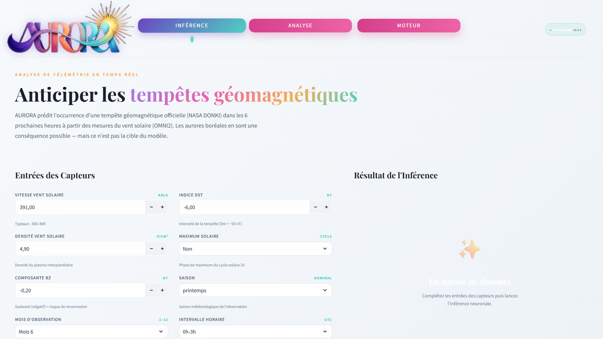
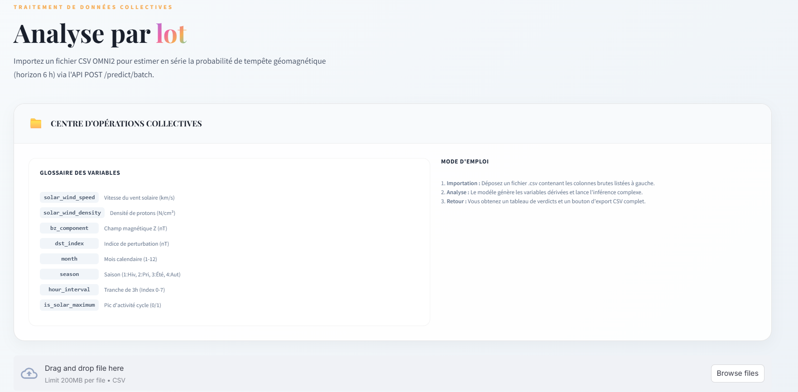
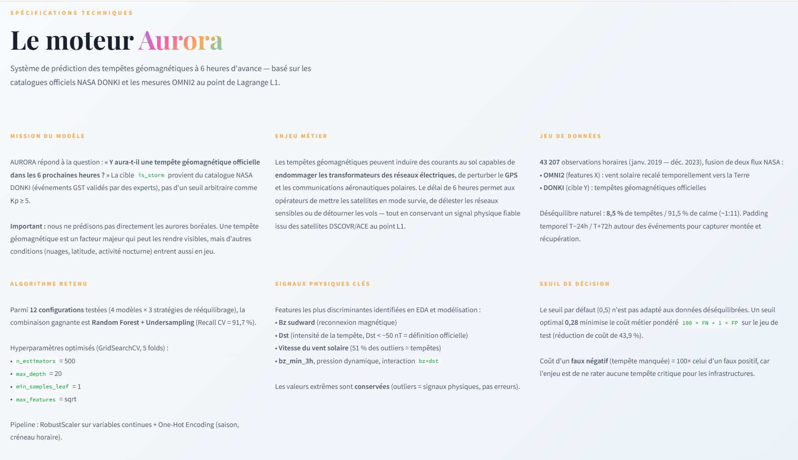
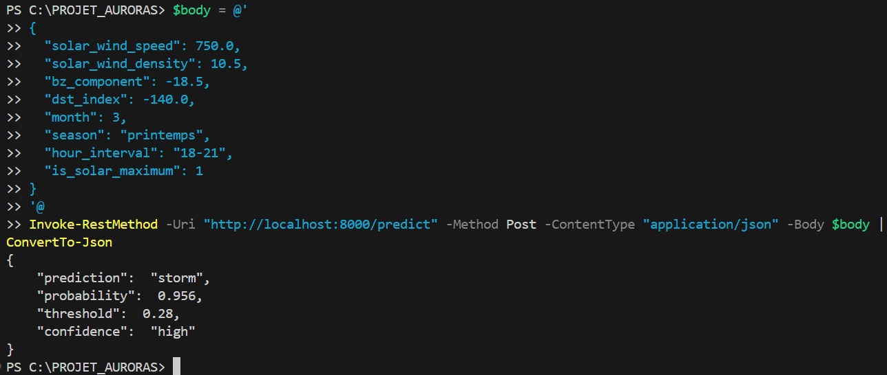
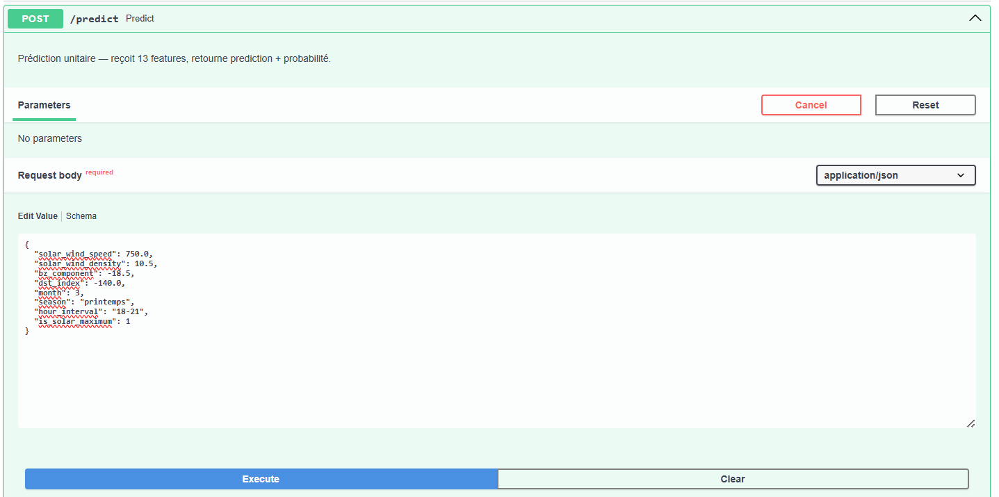
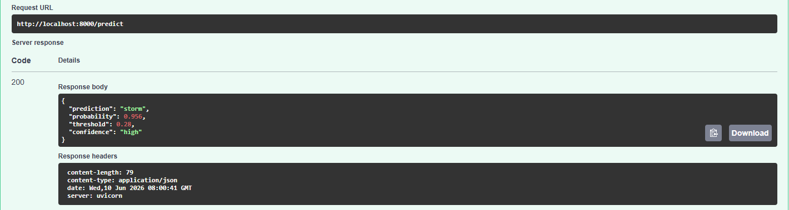
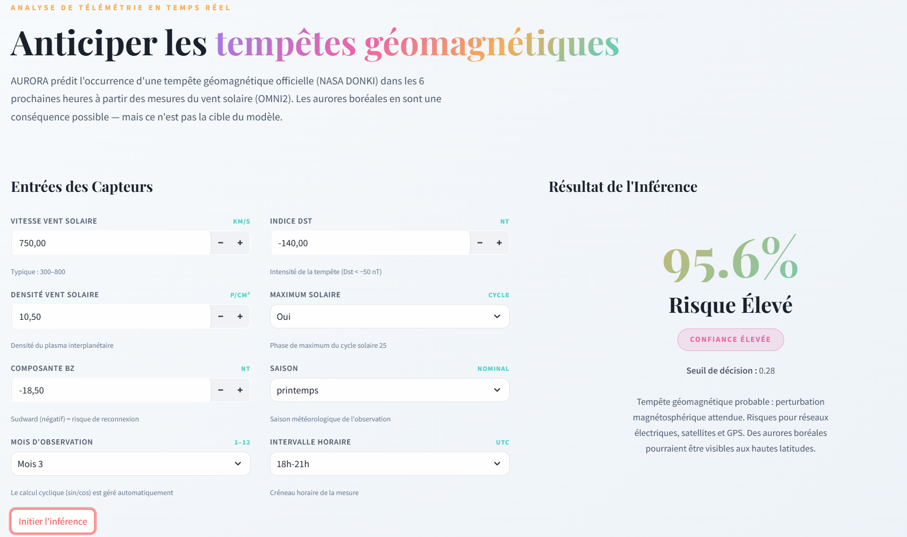
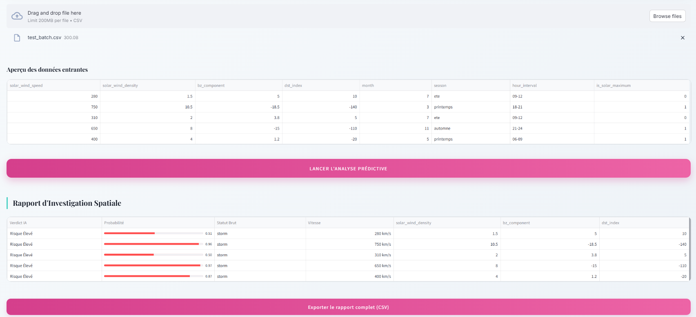

# AURORA — Geomagnetic Storm Prediction


**AURORA** est un système intelligent de prédiction des tempêtes géomagnétiques capable d'anticiper les perturbations solaires **6 heures à l'avance**. Développé à partir des données de la NASA (OMNI2 et DONKI), il s'appuie sur un **Random Forest + RandomUnderSampler** entraîné à maximiser le Recall (seuil optimal : 0.28), afin de ne manquer aucune tempête réelle. L'objectif métier est la **protection des infrastructures critiques** : réseaux électriques, satellites et communications aéronautiques, menacés par les éruptions solaires.

---

## Aperçu de l'Interface


*Formulaire de prédiction unitaire : saisie des paramètres solaires (Bz, vitesse du vent, DST…) et résultat en temps réel.*


*Prédiction par lot : import d'un fichier CSV et visualisation des résultats pour plusieurs observations.*


*Dashboard informatif : métriques de performance, analyse du sur-apprentissage et vue d'ensemble du système.*

---

## Installation & Lancement

### Avec Docker (Recommandé)
Le projet est entièrement conteneurisé pour simplifier le déploiement.
1. Installez Docker et Docker Desktop.
2. Lancez l'ensemble des services :
   ```bash
   docker-compose up --build
   ```
3. Accédez à l'interface : `http://localhost:8501`
4. Accédez à l'API : `http://localhost:8000`

### Sans Docker (Installation Locale)
1. **Prérequis** : Python 3.11+
2. **API (FastAPI)** :
   ```bash
   pip install -r requirements-api.txt
   uvicorn app.api.main:app --reload --port 8000
   ```
3. **Interface (Streamlit)** :
   ```bash
   pip install -r requirements-ui.txt
   streamlit run app/ui/app.py --server.port 8501
   ```

---

## Exemple d'Utilisation

### Test de l'API via commande curl
> **Linux / macOS (Bash) :**
```bash
curl -X 'POST' \
  'http://localhost:8000/predict' \
  -H 'accept: application/json' \
  -H 'Content-Type: application/json' \
  -d '{
  "solar_wind_speed": 750.0,
  "solar_wind_density": 10.5,
  "bz_component": -18.5,
  "dst_index": -140.0,
  "month": 3,
  "season": "printemps",
  "hour_interval": "18-21",
  "is_solar_maximum": 1
}'
```

> **Windows (PowerShell) :** `curl` étant un alias de `Invoke-WebRequest`, utilisez `Invoke-RestMethod` :
```powershell
$body = @'
{
  "solar_wind_speed": 750.0,
  "solar_wind_density": 10.5,
  "bz_component": -18.5,
  "dst_index": -140.0,
  "month": 3,
  "season": "printemps",
  "hour_interval": "18-21",
  "is_solar_maximum": 1
}
'@
Invoke-RestMethod -Uri "http://localhost:8000/predict" -Method Post -ContentType "application/json" -Body $body | ConvertTo-Json
```



*Résultat d'une prédiction : l'API retourne la prédiction (`storm` ou `no_storm`), la probabilité, le seuil utilisé et le niveau de confiance.*

### Test de l'API via Swagger UI
La documentation interactive **Swagger** permet de tester l'API directement depuis le navigateur, sans aucun outil supplémentaire :


*Interface Swagger UI : repérer l'endpoint de prédiction et activer le mode interactif.*


*Exemple de test réussi : les paramètres sont envoyés et le modèle retourne sa décision instantanément.*

### Test de l'Interface Utilisateur (UI)
L'interface Streamlit permet de réaliser des prédictions sans aucune commande technique :


*Saisie unitaire : remplissez les champs et observez la prédiction immédiate.*


*Upload d'un CSV :  traitement en lot et visualisation claire.*

---


## Architecture du Dépôt

```text
C:.
├── app/
│   ├── api/               # Logique de l'API FastAPI
│   │   ├── main.py        # Points d'entrée (endpoints)
│   │   ├── model.py       # Chargement ML et calculs
│   │   ├── schemas.py     # Validation Pydantic
│   │   └── logger.py      # Logs système
│   └── ui/                # Interface Streamlit
│       └── app.py         # Dashboard dynamique
├── assets/                # Logos, bannières et graphiques
├── data/                  # Datasets (bruts et processés)
├── models/                # Modèles sérialisés (.joblib)
├── notebooks/             # Analyse exploratoire (EDA) et modélisation
├── src/                   # Scripts de collecte de données
├── Dockerfile.api         # Configuration Docker API
├── Dockerfile.ui          # Configuration Docker UI
├── docker-compose.yml     # Orchestration des services
└── requirements-*.txt     # Dépendances Python
```

---

## Documentation API
Une fois l'API lancée, la documentation interactive **Swagger** est disponible sur :
[http://localhost:8000/docs](http://localhost:8000/docs)

---

## Limites Connues
*   **Seuil de Décision** : Le modèle est optimisé pour le rappel (Recall) avec un seuil de **0.28**. Cela peut engendrer quelques faux positifs afin de ne manquer aucune tempête réelle.
*   **Données en Temps Réel** : La précision dépend fortement de la qualité des flux de données satellites OMNI2.

---

## Licence
Ce projet est sous licence **MIT**.
